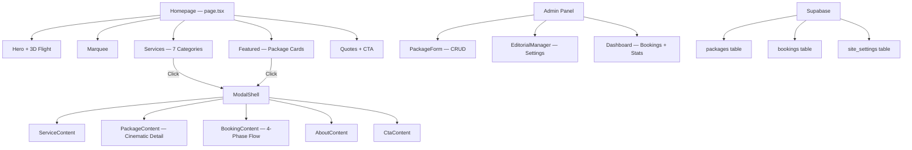

# WanderOn → TouraLuxe: Operational Features Analysis & Implementation Plan

> **Deep-dive analysis of WanderOn.in's tour package operations, mapped against TouraLuxe's cinematic architecture with a TouraLuxe-style implementation strategy.**

---

## 1. WanderOn Feature Audit (What They Do)

### 1.1 Navigation & Package Taxonomy

WanderOn organizes tours through a **multi-level hierarchy**:

| Level | Example | Purpose |
|-------|---------|---------|
| **Top-Level** | International Trips / India Trips | Geography split |
| **Region** | Southeast Asia / Europe / Himalayas | Regional grouping |
| **Destination** | Vietnam / Bali / Ladakh | Country/state pages |
| **Package** | "6 Days Leh Trip with Nubra & Pangong" | Individual tour |

Their navigation uses **mega-menus** with destination thumbnails, trending badges, and quick-links to popular packages.

### 1.2 Listing Page Structure

Each destination page (e.g., `/international-trips/vietnam-tour-packages`) contains:

```
┌─────────────────────────────────────────────────┐
│  Hero: Destination Name + Cover Image + Stats   │
│  (Trip count, starting price, avg duration)      │
├─────────────────────────────────────────────────┤
│  Filter Bar: Duration │ Budget │ Month │ Theme  │
├─────────────────────────────────────────────────┤
│  Package Grid (3-col desktop / 1-col mobile)    │
│  ┌─────────┐ ┌─────────┐ ┌─────────┐           │
│  │ Card 1  │ │ Card 2  │ │ Card 3  │           │
│  │ [Badge] │ │ [Badge] │ │         │           │
│  │ Image   │ │ Image   │ │ Image   │           │
│  │ Title   │ │ Title   │ │ Title   │           │
│  │ 5N/6D   │ │ 3N/4D   │ │ 7N/8D   │           │
│  │ ₹15,999 │ │ ₹22,500 │ │ ₹35,000 │           │
│  │ Batches │ │ Batches │ │ Batches │           │
│  └─────────┘ └─────────┘ └─────────┘           │
├─────────────────────────────────────────────────┤
│  FAQ Section (Accordion)                         │
├─────────────────────────────────────────────────┤
│  Related Destinations Grid                       │
├─────────────────────────────────────────────────┤
│  Testimonials / Reviews Carousel                 │
└─────────────────────────────────────────────────┘
```

### 1.3 Package Card Anatomy

Each tour card shows:

- **Hero Image** — High-quality destination photo
- **Badge System** — `Recommended`, `Trending`, `Family Friendly`, `Super Saver`
- **Title** — Descriptive (includes duration + key stops)
- **Duration** — `5N/6D` format
- **Route** — Start → End points
- **Pricing** — Original price (strikethrough) + Discounted price + "onwards"
- **Batch Dates** — Next 2 upcoming dates + "+ N batches" link
- **Inclusions Preview** — Icons for flight, hotel, meals, transfers
- **CTA** — "View Details" or "Book Now"

### 1.4 Package Detail Page

Individual package pages contain:
- Immersive hero with destination video/image
- Quick summary bar (duration, price, difficulty, group size)
- Day-by-day itinerary (accordion format)
- Inclusions & Exclusions (✓ and ✗ lists)
- Batch dates calendar with availability status
- Pricing table (per person, child, triple sharing, etc.)
- FAQ section
- Reviews/testimonials from past travelers
- Related/similar trips grid
- **Sticky booking bar** (fixed at bottom — price + "Book Now")

### 1.5 Batch/Date Management

WanderOn's key operational differentiator:
- **Fixed departure dates** ("batches") for group trips
- Multiple batches per package (e.g., "9 May, 16 May + 10 batches")
- Availability status per batch (Available / Filling Fast / Sold Out)
- Minimum group size requirements (typically 12 pax)

### 1.6 Booking & Inquiry Flow

- Multi-step form: Select Package → Choose Date → Enter Details → Payment
- WhatsApp integration for instant support
- Lead capture forms on every page
- CRM integration for follow-ups

### 1.7 Content & SEO Strategy

- Dedicated destination landing pages with unique content
- Blog integration with travel guides
- FAQ schemas for rich snippets
- Review/rating display

---

## 2. TouraLuxe Current State (What We Have)

### Architecture Summary



### Current Data Model (`Package` type)

| Field | Type | Status |
|-------|------|--------|
| `title` | string | ✅ Have |
| `location` | string | ✅ Have |
| `image` | string | ✅ Have |
| `price` | string | ✅ Have |
| `child_price` | string | ✅ Have |
| `infant_price` | string | ✅ Have |
| `duration` | string | ✅ Have |
| `guests` | string | ✅ Have |
| `season` | string | ✅ Have |
| `tagline` | string | ✅ Have |
| `description` | string | ✅ Have |
| `highlights` | string[] | ✅ Have |
| `inclusions` | string[] | ✅ Have |
| `itinerary` | json[] | ✅ Have |
| `category` | string[] | ✅ Have |
| `is_published` | boolean | ✅ Have |
| `sort_order` | number | ✅ Have |
| `tax_status` | string | ✅ Have |
| `currency` | string | ✅ Have |
| `exclusions` | string[] | ❌ Missing |
| `destination` | string (FK) | ❌ Missing |
| `difficulty_level` | string | ❌ Missing |
| `original_price` | string | ❌ Missing |
| `badge` | string | ❌ Missing |
| `route_start` | string | ❌ Missing |
| `route_end` | string | ❌ Missing |
| `batch_dates` | json[] | ❌ Missing |
| `min_group_size` | number | ❌ Missing |
| `max_group_size` | number | ❌ Missing |
| `gallery` | string[] | ❌ Missing |
| `faq` | json[] | ❌ Missing |
| `is_featured` | boolean | ❌ Missing |
| `tags` | string[] | ❌ Missing |

### Current Strengths (Keep & Amplify)

- ✅ **Cinematic Package Detail** — Scroll-snapping chapters, celestial nav, parallax hero
- ✅ **Unified Modal System** — Full-viewport immersive modals with view stacking
- ✅ **Booking Flow** — 4-phase discovery → timeline → guests → finalize
- ✅ **Dynamic Admin** — Full CRUD with real-time Supabase subscriptions
- ✅ **Fiscal Engine** — Tax-inclusive/exclusive logic, multi-currency
- ✅ **Discovery Search** — Fuse.js with NLP token filtering
- ✅ **3D Flight Engine** — Unique brand differentiator

---

## 3. Gap Analysis: What WanderOn Has That We Need

### 🔴 Critical Gaps (High Impact)

| # | Feature | WanderOn | TouraLuxe | Impact |
|---|---------|----------|-----------|--------|
| 1 | **Destination Pages** | Dedicated SEO pages per destination | No destination pages at all | Massive SEO + Browse UX |
| 2 | **Package Listing Grid** | Filterable multi-column grid | Only 3 cards in Featured section | Package discoverability |
| 3 | **Filter System** | Duration/Budget/Month/Theme filters | Only text search in booking | Browse vs. search balance |
| 4 | **Batch Dates** | Fixed departures with availability | No date management | Operational core for group trips |
| 5 | **Original vs. Discounted Price** | Strikethrough + savings display | Single price only | Conversion psychology |
| 6 | **Package Badges** | Trending/Recommended/Family tags | No badge system | Visual sorting + trust |
| 7 | **Exclusions List** | Clear what's NOT included | Only inclusions exist | Transparency + trust |
| 8 | **FAQ per Package** | Accordion FAQs | No FAQ system | SEO + reduced inquiries |
| 9 | **Gallery (Multi-Image)** | Image carousel per package | Single image | Visual richness |
| 10 | **Related Packages** | "Similar trips" grid | No recommendations | Cross-sell / engagement |

### 🟡 Important Gaps (Medium Impact)

| # | Feature | WanderOn | TouraLuxe | Impact |
|---|---------|----------|-----------|--------|
| 11 | **Sticky Booking Bar** | Fixed bottom bar on detail pages | Floating pill (have it!) | ✅ Already better |
| 12 | **WhatsApp Integration** | Floating WhatsApp button | No chat widget | Lead capture |
| 13 | **Review/Rating System** | Star ratings + testimonials | Quotes section (editorial) | Social proof |
| 14 | **Route Display** | Start → End point visualization | Location field only | Trip clarity |
| 15 | **Group Size Display** | Min/Max pax with status | "Ideal For" text field | Operational clarity |

### 🟢 TouraLuxe Advantages (Where We're Already Better)

| Feature | TouraLuxe | WanderOn |
|---------|-----------|----------|
| **Visual Design** | Cinematic, Apple-level polish | Standard travel site template |
| **3D Experience** | WebGL flight engine | Static images |
| **Package Detail** | Full-viewport scroll-snap chapters | Simple scrollable page |
| **Booking UX** | 4-phase immersive flow | Standard form |
| **Animations** | GSAP + Lenis + Magnetic physics | Basic CSS transitions |
| **Admin Panel** | Dynamic editorial control | Not visible |
| **Pricing Engine** | Tax-aware multi-tier pricing | Simple display |

---

## 4. Implementation Strategy: The TouraLuxe Way

> **Philosophy**: We don't copy WanderOn's template aesthetic. We take their *operational intelligence* and deliver it through our *cinematic language*.

### Phase 1: Data Foundation (Schema + Admin Enrichment)

**Goal**: Enrich the package data model to support all operational features.

#### 1A. Database Schema Additions

New columns for `packages` table:

```sql
-- Pricing & Promotions
ALTER TABLE packages ADD COLUMN original_price TEXT;          -- Strikethrough price
ALTER TABLE packages ADD COLUMN badge TEXT;                    -- 'Trending', 'Bestseller', 'New', etc.
ALTER TABLE packages ADD COLUMN is_featured BOOLEAN DEFAULT false;

-- Logistics
ALTER TABLE packages ADD COLUMN exclusions TEXT[] DEFAULT '{}';
ALTER TABLE packages ADD COLUMN route_start TEXT;
ALTER TABLE packages ADD COLUMN route_end TEXT;
ALTER TABLE packages ADD COLUMN difficulty_level TEXT DEFAULT 'Easy';
ALTER TABLE packages ADD COLUMN min_group_size INTEGER DEFAULT 1;
ALTER TABLE packages ADD COLUMN max_group_size INTEGER DEFAULT 20;

-- Content
ALTER TABLE packages ADD COLUMN gallery TEXT[] DEFAULT '{}';
ALTER TABLE packages ADD COLUMN faq JSONB DEFAULT '[]';       -- [{q: "", a: ""}]
ALTER TABLE packages ADD COLUMN tags TEXT[] DEFAULT '{}';      -- Free-form searchable tags

-- Taxonomy
ALTER TABLE packages ADD COLUMN destination TEXT;              -- e.g., 'vietnam', 'ladakh'
ALTER TABLE packages ADD COLUMN region TEXT;                   -- e.g., 'southeast-asia', 'himalayas'
ALTER TABLE packages ADD COLUMN trip_type TEXT DEFAULT 'group'; -- 'group', 'private', 'custom'
```

New table for batch dates:

```sql
CREATE TABLE batch_dates (
  id UUID DEFAULT gen_random_uuid() PRIMARY KEY,
  package_id UUID REFERENCES packages(id) ON DELETE CASCADE,
  start_date DATE NOT NULL,
  end_date DATE NOT NULL,
  status TEXT DEFAULT 'available',       -- 'available', 'filling_fast', 'sold_out'
  slots_total INTEGER DEFAULT 20,
  slots_booked INTEGER DEFAULT 0,
  price_override TEXT,                   -- Optional per-batch pricing
  created_at TIMESTAMP DEFAULT NOW()
);
```

New table for destinations:

```sql
CREATE TABLE destinations (
  id UUID DEFAULT gen_random_uuid() PRIMARY KEY,
  name TEXT NOT NULL,                     -- 'Vietnam'
  slug TEXT UNIQUE NOT NULL,              -- 'vietnam'
  region TEXT,                            -- 'Southeast Asia'
  country TEXT,                           -- 'Vietnam'  
  cover_image TEXT,
  description TEXT,
  meta_title TEXT,
  meta_description TEXT,
  faq JSONB DEFAULT '[]',
  stats JSONB DEFAULT '{}',              -- {packages: 12, starting_price: 35000}
  is_international BOOLEAN DEFAULT true,
  sort_order INTEGER DEFAULT 99,
  is_published BOOLEAN DEFAULT true,
  created_at TIMESTAMP DEFAULT NOW()
);
```

#### 1B. Admin Panel Enrichment (PackageForm.tsx)

New sections to add to the existing form:

- **Promotions Section**: Original price, badge selector, featured toggle
- **Logistics Section**: Route start/end, difficulty level, group size min/max
- **Exclusions List**: Mirror of inclusions editor
- **FAQ Editor**: Question/Answer pairs with add/remove
- **Gallery Manager**: Multi-image upload with drag-to-reorder
- **Batch Dates Manager**: Calendar-based date picker with status toggles
- **Destination Selector**: Dropdown linked to destinations table
- **Tags Input**: Free-form tag chips

---

### Phase 2: Browse & Discovery (Listing Pages + Filters)

**Goal**: Create destination-based listing pages with filtering, in TouraLuxe's cinematic style.

#### 2A. New Route: `/destinations/[slug]`

A dedicated page for each destination (e.g., `/destinations/vietnam`), featuring:

```
┌──────────────────────────────────────────────────────┐
│  CINEMATIC HERO                                       │
│  Full-bleed destination cover with parallax           │
│  Title: "Vietnam" + Region badge                     │
│  Stats: "12 Journeys · From ₹35,000 · 3-14 Days"   │
│  Atmospheric gradient fade into content               │
├──────────────────────────────────────────────────────┤
│  FILTER CONSTELLATION (Our Style)                     │
│  Not a boring filter bar — a floating glassmorphism  │
│  pill with segmented controls:                       │
│  [Duration ▾] [Budget ▾] [Month ▾] [Type ▾]        │
│  Active filters shown as dismissible tags below      │
├──────────────────────────────────────────────────────┤
│  PACKAGE GRID                                         │
│  Masonry/grid layout with staggered GSAP reveals     │
│  Each card: TouraLuxe-style with cinematic hover     │
│  Badge overlays, magnetic interactions               │
├──────────────────────────────────────────────────────┤
│  DESTINATION FAQ (Accordion with micro-animations)   │
├──────────────────────────────────────────────────────┤
│  RELATED DESTINATIONS (Horizontal scroll)            │
└──────────────────────────────────────────────────────┘
```

#### 2B. New Route: `/destinations` (All Destinations)

A discovery page showing all destinations with:
- Region-based grouping (International / India)
- Search with our existing Fuse.js engine
- Card grid with destination cover images
- Package count + starting price overlay

#### 2C. The TouraLuxe Package Card (New Component)

A card designed for grid listing, distinct from the current Featured layout:

```
┌────────────────────────────────┐
│  [Badge: Trending]             │ ← Floating badge overlay
│                                │
│  ┌──────────────────────────┐  │
│  │    COVER IMAGE           │  │ ← 16:9 with parallax on hover
│  │    (with gradient mask)  │  │
│  └──────────────────────────┘  │
│                                │
│  LOCATION · DURATION           │ ← Muted metadata
│  Package Title                 │ ← Bold, tracking-tight
│                                │
│  ₹35,000  ₹̶4̶5̶,̶0̶0̶0̶            │ ← Price with strikethrough
│  per person · excl. tax        │
│                                │
│  ┌────┐ ┌────┐ ┌────┐         │
│  │ ✈  │ │ 🏨 │ │ 🍽 │         │ ← Inclusion icons
│  └────┘ └────┘ └────┘         │
│                                │
│  Next: 15 Jun, 22 Jun +8      │ ← Batch dates preview
│                                │
│  ────── View Details ──────   │ ← Magnetic underline CTA
└────────────────────────────────┘
```

#### 2D. Filter System Architecture

```
FilterEngine (client-side, instant)
├── Duration Filter: [1-3 days] [4-7 days] [8-14 days] [14+]
├── Budget Filter: [Under ₹20K] [₹20K-50K] [₹50K-1L] [₹1L+]
├── Month Filter: [Jan] [Feb] ... [Dec] (based on batch_dates)
├── Type Filter: [Group] [Private] [Honeymoon] [Adventure]
├── Difficulty: [Easy] [Moderate] [Challenging]
└── Sort: [Price ↑↓] [Duration ↑↓] [Popularity] [Newest]
```

---

### Phase 3: Enhanced Package Detail (Enriched Modal)

**Goal**: Add WanderOn's operational content to our existing cinematic PackageContent.

#### 3A. New Chapters for PackageContent.tsx

Add these to the existing scroll-snap chapter system:

| New Chapter | Content | Position |
|-------------|---------|----------|
| **Gallery** | Full-bleed image carousel with counter | After Introduction |
| **Exclusions** | ✗ list (red-tinted design) | After Inclusions |
| **Batch Calendar** | Visual calendar with availability dots | Before Next Steps |
| **FAQ** | Accordion with smooth expand/collapse | Before Next Steps |
| **Related** | Horizontal scroll of similar packages | Final chapter |

#### 3B. Enhanced Pricing Pill

Upgrade the existing floating pill to show:
- Original price (strikethrough) when discount exists
- Savings amount/percentage
- "Filling Fast" indicator when batch is nearly full
- Next available date

#### 3C. Gallery Experience

A cinematic image carousel within the modal:
- Full-bleed images with swipe/drag
- Counter overlay (1/8)
- Thumbnail strip for desktop
- Ken Burns subtle zoom effect on each image

---

### Phase 4: Operational Intelligence (Batch Dates + Lead Capture)

**Goal**: Add the operational features that make a travel business actually work.

#### 4A. Batch Date Management (Admin)

New admin section: **Departure Calendar**

- Visual calendar interface for adding batch dates
- Status toggles: Available → Filling Fast → Sold Out
- Slot tracking (total vs. booked)
- Bulk actions (add weekly batches, copy from another package)
- Per-batch price overrides for peak seasons

#### 4B. Destination Management (Admin)

New admin section: **Destination Studio**

- CRUD for destinations with cover images
- SEO fields (meta title, description)
- FAQ editor per destination
- Region assignment
- Package count auto-calculated

#### 4C. WhatsApp Integration

A floating action button in TouraLuxe style:
- Magnetic physics interaction
- Context-aware pre-filled message based on current page/package
- Glassmorphism design matching our navbar aesthetic
- Appears after 5 seconds or on scroll

#### 4D. Enhanced Search & Discovery

Upgrade the existing `DiscoveryService.ts`:
- Search across destinations, not just package titles
- Filter by tags, categories, and duration
- "Trending" algorithm based on booking count + recency
- "Similar packages" recommendation engine

---

## 5. Prioritized Roadmap

### Sprint 1: Data Foundation (Week 1-2)
> Database schema changes + Admin enrichment

- [ ] Run SQL migrations for new columns
- [ ] Create `destinations` and `batch_dates` tables
- [ ] Add Exclusions editor to PackageForm
- [ ] Add FAQ editor to PackageForm
- [ ] Add Badge/Promotions section to PackageForm
- [ ] Add Gallery multi-upload to PackageForm
- [ ] Add Route Start/End fields
- [ ] Add Destination selector dropdown

### Sprint 2: Listing Pages (Week 3-4)
> New routes + Package cards + Filter system

- [ ] Create `/destinations` all-destinations page
- [ ] Create `/destinations/[slug]` destination detail page
- [ ] Build `PackageCard` component (grid-optimized)
- [ ] Build `FilterBar` component with segmented controls
- [ ] Build client-side filter engine
- [ ] Add destination hero with parallax
- [ ] Add related destinations section
- [ ] Add FAQ accordion component
- [ ] SEO: meta tags, structured data, OG images

### Sprint 3: Detail Enrichment (Week 5-6)
> Enhance PackageContent modal with new chapters

- [ ] Add Gallery carousel chapter
- [ ] Add Exclusions chapter (red-tinted)
- [ ] Add Batch Calendar chapter
- [ ] Add FAQ accordion chapter
- [ ] Add Related Packages chapter
- [ ] Enhance pricing pill with discount display
- [ ] Add "Filling Fast" / availability indicators

### Sprint 4: Operations Layer (Week 7-8)
> Batch management + Lead capture + Discovery

- [ ] Build Batch Date Manager in admin
- [ ] Build Destination Studio in admin
- [ ] Add WhatsApp floating button
- [ ] Upgrade DiscoveryService with destination search
- [ ] Add "Trending" algorithm
- [ ] Add related packages recommendation engine
- [ ] Add Navbar mega-menu for destinations

---

## 6. Key Design Decisions to Discuss

> [!IMPORTANT]
> These architectural choices will shape the entire implementation. Let's align before coding.

### Decision 1: Destination Pages — Modal or Full Page?

**Option A: Full Next.js Pages** (`/destinations/[slug]`)
- ✅ SEO-friendly, crawlable, shareable URLs
- ✅ Independent loading, better performance
- ❌ Breaks the current single-page cinematic flow

**Option B: Enhanced Modal System** (Keep everything in modals)
- ✅ Maintains the immersive single-page experience
- ✅ Consistent with current architecture
- ❌ Poor SEO, no shareable destination URLs

**Recommended: Hybrid** — Full pages for destination listings (SEO), modals for package details (UX).

### Decision 2: Package Cards — Where on Homepage?

**Option A**: Replace current Featured section with a filterable grid
**Option B**: Keep Featured as a curated showcase, add "Explore All" link to `/destinations`
**Option C**: Add a new "Discover" section between Featured and Quotes

**Recommended: Option B** — Featured stays cinematic (curated), new Destinations section links out.

### Decision 3: Batch Dates — Core Feature or Phase 2?

- If TouraLuxe operates **group tours with fixed dates** → Sprint 1 (core)
- If TouraLuxe is **custom/private tours only** → Sprint 4 (nice-to-have)

### Decision 4: How Many Destination Pages Initially?

Start with 5-10 key destinations, or build the system and populate later?

---

## 7. File Impact Map

### New Files to Create

| File | Purpose |
|------|---------|
| `src/app/destinations/page.tsx` | All destinations listing |
| `src/app/destinations/[slug]/page.tsx` | Individual destination page |
| `src/components/PackageCard.tsx` | Grid-optimized package card |
| `src/components/FilterBar.tsx` | Glassmorphism filter controls |
| `src/components/sections/Destinations.tsx` | Homepage destinations teaser |
| `src/components/GalleryCarousel.tsx` | Multi-image carousel |
| `src/components/FAQAccordion.tsx` | Animated FAQ component |
| `src/components/BatchCalendar.tsx` | Date picker with availability |
| `src/components/WhatsAppButton.tsx` | Floating WhatsApp CTA |
| `src/app/admin/destinations/page.tsx` | Destination management |
| `src/app/admin/components/DestinationForm.tsx` | Destination CRUD form |
| `src/app/admin/components/BatchManager.tsx` | Batch date management |
| `src/app/api/destinations/route.ts` | Destinations CRUD API |
| `src/app/api/batch-dates/route.ts` | Batch dates API |

### Existing Files to Modify

| File | Changes |
|------|---------|
| [PackageForm.tsx](file:///Users/adarsh/Downloads/TouraLuxe/src/app/admin/components/PackageForm.tsx) | Add exclusions, FAQ, gallery, badges, route, batch dates sections |
| [PackageContent.tsx](file:///Users/adarsh/Downloads/TouraLuxe/src/components/modals/PackageContent.tsx) | Add gallery, exclusions, FAQ, related packages chapters |
| [supabase.ts](file:///Users/adarsh/Downloads/TouraLuxe/src/lib/supabase.ts) | Update `Package` type with new fields |
| [DiscoveryService.ts](file:///Users/adarsh/Downloads/TouraLuxe/src/services/DiscoveryService.ts) | Add destination search, tag search, filters |
| [Navbar.tsx](file:///Users/adarsh/Downloads/TouraLuxe/src/components/Navbar.tsx) | Add "Destinations" nav link, potential mega-menu |
| [Featured.tsx](file:///Users/adarsh/Downloads/TouraLuxe/src/components/sections/Featured.tsx) | Add badge display, discount pricing, batch preview |
| [packages/route.ts](file:///Users/adarsh/Downloads/TouraLuxe/src/app/api/packages/route.ts) | Add filter query params, destination filtering |
| [BookingContent.tsx](file:///Users/adarsh/Downloads/TouraLuxe/src/components/modals/BookingContent.tsx) | Integrate batch date selection in timeline phase |
| [page.tsx](file:///Users/adarsh/Downloads/TouraLuxe/src/app/page.tsx) | Add destinations teaser section |

---

## 8. Technical Notes

### Performance Considerations
- Destination pages should use **ISR (Incremental Static Regeneration)** for SEO + speed
- Package cards should lazy-load images with blur placeholders
- Filter engine stays **client-side** for instant UX (no server round-trips)
- Gallery images should use `next/image` with responsive `sizes` 

### Design Language Consistency
- All new components follow the existing **#0a0a0a + #f5f5f7** dark palette
- Filters use **glassmorphism pills** matching our navbar/modal aesthetic
- Animations use **GSAP + ScrollTrigger** with `expo.out` easing
- Cards use **Magnetic** wrapper for hover physics
- Typography stays **Inter** with tracking-tight headings

---

> [!TIP]
> **The core insight**: WanderOn's power is in *operational structure* (destinations, batches, filters). TouraLuxe's power is in *experiential design* (cinema, 3D, physics). The winning formula is merging both — WanderOn's operational brain with TouraLuxe's cinematic skin.
